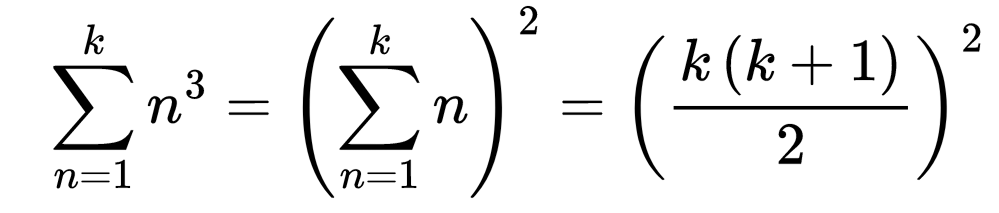
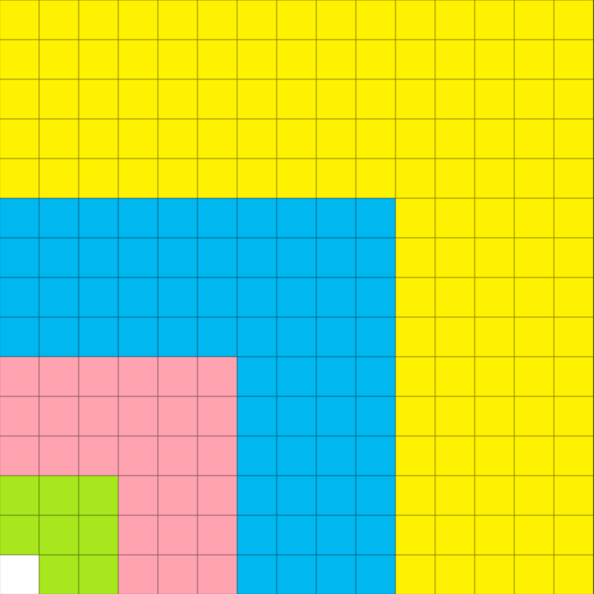

# 一道数学题

Mathematics and Plausible Reasoning第一章有个数学题目：

```
Observe the values of the consecutive sums
1,
1 + 8,
1 + 8 + 27,
1 + 8 + 27 + 64,
. .. .
Is there a simple rule?
```

昨天晚上一直在思考这个问题，最近几年我比较倾向于无纸化办公，但是我发现不用纸笔很难准确描述我的想法，因为我发现的规律是这样的：

<div align="center">

</div>

之后，我想要从几何的角度更直观的认识这个规律，于是我努力想像把三维正方体在平面展开的样子，于是就有了这张图。

<div align="center">

</div>

```
1³ = (1)²
1³ + 2³ = (1 + 2)²
1³ + 2³ + 3³ = (1 + 2 + 3)²
1³ + 2³ + 3³ + 4³ = (1 + 2 + 3 + 4)²
1³ + 2³ + 3³ + 4³ + 5³ = (1 + 2 + 3 + 4 + 5)²
```

我又在[phind](https://www.phind.com)考验了一下GPT-4，发现勾选Expert和Creative后，给出的答案非常让人满意。

<div align="center">

</div>
